# 📝 TaskFlow - Your Personal Task Manager

TaskFlow is a sleek, intuitive, and high-performance task management application built with **Flutter**. It is designed to help users organize their daily lives with ease, featuring a clean UI, robust local storage, and smart categorization.

---

## ✨ Key Features

* **Full CRUD Operations:** Create, read, update, and delete tasks seamlessly.
* **Smart Search & Filtering:** Quickly find tasks by title or filter by status.
* **Time Management:** Integrated date and time pickers for setting precise deadlines.
* **Categorization:** Organize your life with labels like *Personal, Work, Shopping,* and more.
* **Priority System:** Visual indicators for 🔥 High, 🟡 Medium, and 🟢 Low priority tasks.
* **Insightful Dashboard:** A dedicated statistics screen to track your productivity trends.
* **Personalization:** Full support for **Dark/Light Mode** and user profile management.
* **Data Persistence:** Powered by `SharedPreferences` to ensure your data stays on your device safely.

---

## 📸 Screenshots

### 🔐 Authentication & Onboarding
| Splash Screen | Welcome | Login |
| :---: | :---: | :---: |
| 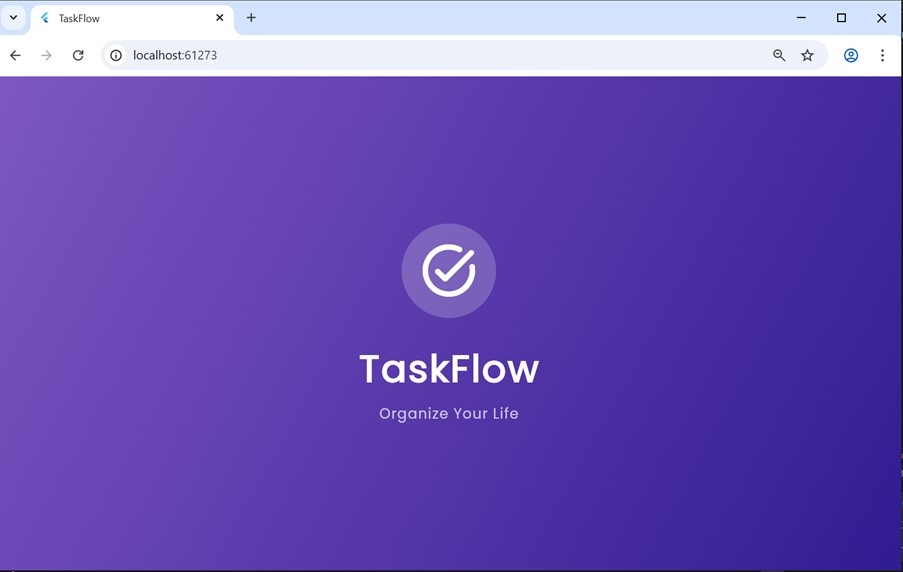 | 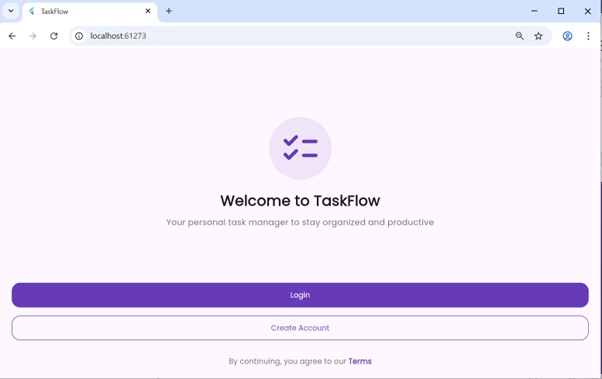 | 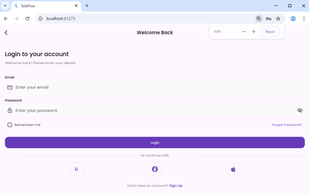 |

| Validation | Sign Up | Sign Up Form |
| :---: | :---: | :---: |
| 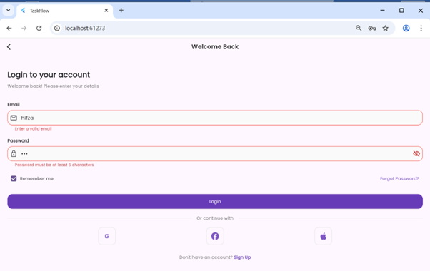 | 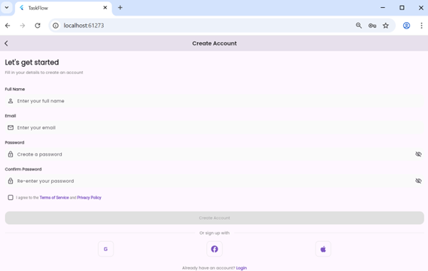 | 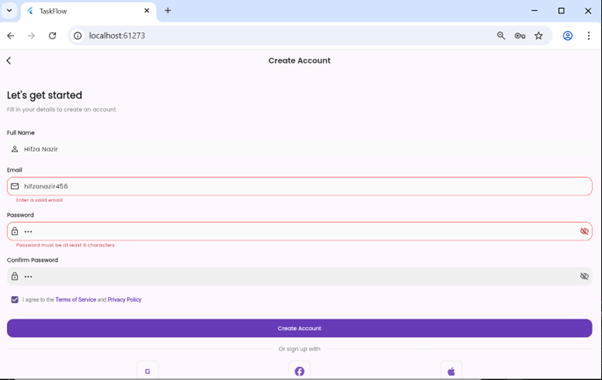 |

### 🛠️ Core Management
| Home Dashboard | Task Details | Add New Task |
| :---: | :---: | :---: |
| 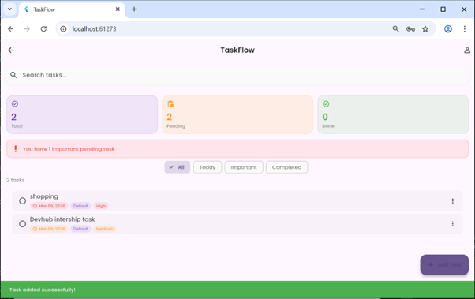 | 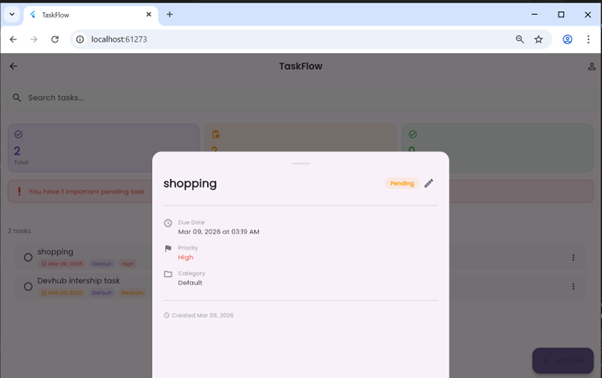 | 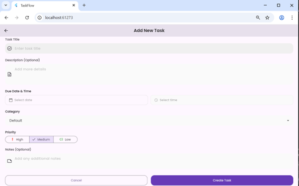 |

| Tasks List | Date Picker | Time Picker |
| :---: | :---: | :---: |
| 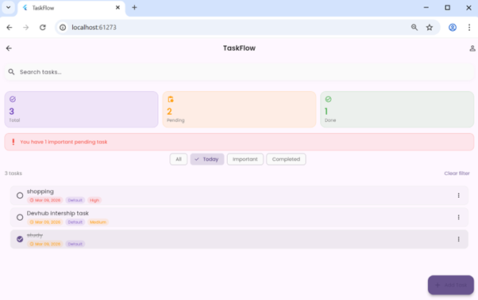 | 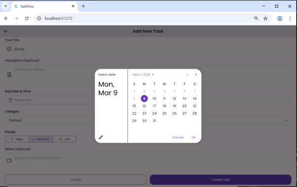 | 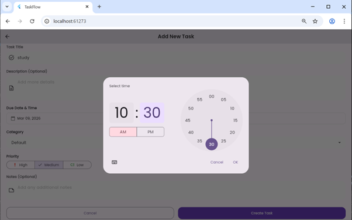 |

### 👤 Profile & Settings
| Profile Screen | Settings |
| :---: | :---: |
| 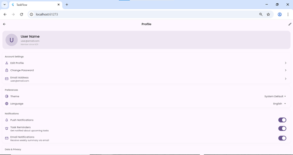 | 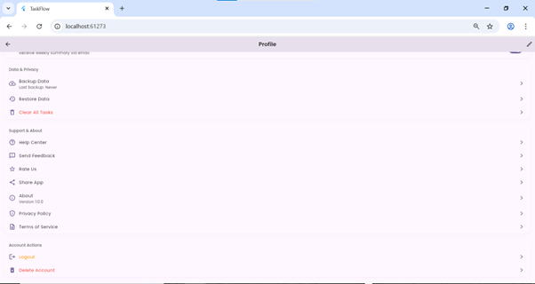 |

---

## 🚀 Getting Started

### Prerequisites
* **Flutter SDK:** ^3.0.0
* **Dart SDK:** ^3.0.0
* An IDE (VS Code or Android Studio)

### Installation

1.  **Clone the repository:**
    ```bash
    git clone [https://github.com/hifzanazir00781/DevHub_flutter_Task_Manager_App.git](https://github.com/hifzanazir00781/DevHub_flutter_Task_Manager_App.git)
    ```

2.  **Navigate to the project folder:**
    ```bash
    cd DevHub_flutter_Task_Manager_App
    ```

3.  **Install dependencies:**
    ```bash
    flutter pub get
    ```

4.  **Run the application:**
    ```bash
    flutter run
    ```

---

## 📁 Project Architecture

```text
lib/
├── models/           # Task and User data structures
├── screens/          # All UI Views (Auth, Home, Profile, etc.)
├── services/         # Logic for SharedPreferences & Local Storage
├── utils/            # App constants, themes, and helper functions
├── widgets/          # Custom reusable UI components
└── main.dart         # App entry point
